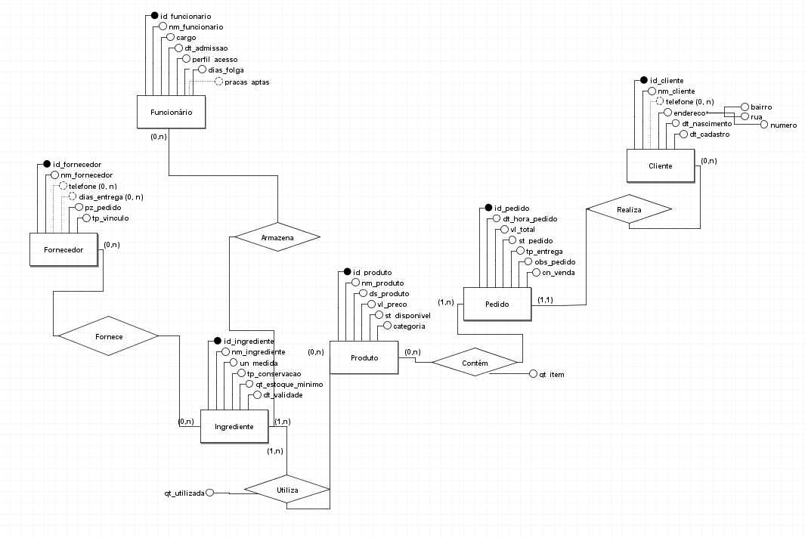

# Entrega 1 — Modelo Conceitual (DER)
### Modelagem de um sistema de gestão de informações para uma organização de pequeno porte

---

## Metadados

- **Nomes dos alunos e RGM**
  Murilo Silva de Jesus - 47940921
  Vinicius Ferreira Shinohara - 48101290
  Ítalo Augusto Gomes Azarias - 48262668
  Matheus Camargo Xavier da Costa - 47996544
  Marcos Vinicius Oliveira de Almeida - 47866381

## 1. Caracterização da Organização
*(vale 7,5% — Dimensão Conceitual)*

- **Nome e natureza da organização:** A organização escolhida foi uma Hamburgueria
- **Contexto e porte:** É uma hamburguria com fins lucrativos, esta em operação desde 2019, conta com 10/14 funcionários, com um volume aproximado de 100 pedidos por dia envolvendo Ifood, 99 e Keeta. O WhatsApp funciona apenas como canal de captação.
- **Problemas e necessidades identificados:** 
  1. Não há como identificar o responsável quando um pedido sai errado.
  2. Não existe medição de tarefas/missões da equipe
  3. Não há acompanhamentos da curva de aprendizado.
  4. Mesmo a organização ja tendo um sistema próprio, o checklist de estoque é feito manualmente no domingo a noite por conta de hábito operacional.
- **Justificativa da escolha:** A organização foi escolhida por fácil acesso por conta do dono ser primo de um dos integrantes.
- **Evidências da organização:** 

---

## 2. Processos de Negócio
*(vale 10% — Dimensão Procedimental)*

- **Principais processos mapeados:** Cadastro de clientes, Gestão de cardápio e receitas, controle de estoque de ingredientes, gestão de fornecedores e compras, processamento de pedidos, organização da equipe.
- **Fluxogramas:** (Opcional) *represente visualmente pelo menos os processos-chave (imagens anexadas). Deve ficar claro o fluxo de cada processo e como eles se integram entre si.*

---

## 3. Requisitos do Sistema
*(esta seção e a Seção 4 "Regras de Negócio" DIVIDEM 7,5% na dimensão conceitual — juntas valem 7,5%, não 7,5% cada — + 4% exclusivos desta seção na organização/documentação)*

### 3.1 Requisitos Funcionais
1. Cadastro e consulta de clientes com histórico de pedidos.
2. Gestão do cardápio (produtos, preços, categorias). 
3. Definição de receitas (ingredientes e quantidades por produto). 
4. Registro de pedidos com canal de venda, modo de entrega e forma de pagamento.
5. Identificação de qual funcionário executou cada etapa do pedido em cada praça.
6. Controle de estoque com data de validade e estoque mínimo.
7. Gestão de fornecedores com dias de entrega e prazo de pedido.
8. Consulta de consumo de insumos por período.

### 3.2 Requisitos Não Funcionais
1. Segurança, apenas administradores podem cancelar pedidos.
2. Interface simples.
3. Suportar até 100 pedidos por dia.

---

## 4. Regras de Negócio
*(esta seção DIVIDE com a Seção 3 "Requisitos do Sistema" os mesmos 7,5% da dimensão conceitual — juntas valem 7,5%, não 7,5% cada — + 4% exclusivos desta seção na documentação. "Regras de negócio" é o termo técnico usado em modelagem de dados para as regras de funcionamento de qualquer organização, com ou sem fins lucrativos)*

- **Regras operacionais:** 
1. Quando um insume atinge o estoque mínimo, uma ordem de compra deve ser aberta.
2. Deve-se usar o insumo de validade mais curta.
3. Os ingredientes dos lanches sao padronizados e devem ser montades de acordo com a ficha técnica.
4. Cada fornecedor tem dias fixos de entrega e prazo de pedido.
- **Restrições organizacionais:** 
1. Espaço físico limitado - congelados tem limite maximo de duas semanas.
2. Dependencia de plataformas externas como 99 Food, Ifood e Keeta.
3. LGPD, dados do cliente precisam de tratamento especial.
---

## 5. Dicionário de Dados Conceitual (Preliminar)
*(vale 10% — Dimensão Procedimental - Segue o modelo do arquivo 02-03g_Exemplo_Dicionario_Dados.pdf)*

Para cada entidade identificada, liste:

| Atributo | Descrição | Regra de negócio associada |
|----------|-----------|------------------------------|
| *nome do atributo* | *o que ele representa* | *se houver alguma regra (obrigatoriedade, valores possíveis, etc.)* |

*Mantenha o dicionário organizado e padronizado (mesmo formato de tabela para todas as entidades).*

**Atenção à privacidade:** se forem usados exemplos de valores para ilustrar os atributos, esses exemplos devem ser **fictícios** — não utilize dados reais de clientes, fiéis, beneficiários, doadores ou funcionários da organização (nomes, CPFs, contatos etc.), mesmo que tenham sido observados durante a pesquisa de campo. Os exemplos devem apenas ser **coerentes com as operações reais** observadas.

---

## 6. Modelagem Conceitual (Entidades, Atributos, Relacionamentos)
*(vale 7,5% na dimensão conceitual)*

- **Entidades reconhecidas:** *liste e justifique brevemente cada uma.*
- **Atributos e classificações:** *quais atributos pertencem a cada entidade.*
- **Relacionamentos pertinentes:** *como as entidades se conectam.*
- **Restrições e políticas organizacionais aplicadas ao modelo.**

---

## 7. Diagrama Entidade-Relacionamento (DER)
*(vale 20% — é o item de maior peso da entrega)*

---

## 8. Justificativa Técnica
*(vale 7,5% — sozinho, é o subcritério de maior peso dentro da Dimensão Conceitual)*

As entidades do modelo(Funcionário, fornecedor, ingrediente, produto, pedido e cliente) representam os objetos centrais da operação, todos indentificamos na entrevista. Os relacionamentos seguem a lógica real do negócio. As cardianalidades refletem restrições, por exemplo, um pedido pertence a exatamente um cliente, mas um cliente pode fazer varios pedidos ao longo do tempo.

---

## 9. Uso de Inteligência Artificial
*(documentação obrigatória — não é opcional se o grupo usou IA em qualquer etapa: pesquisa, escrita, organização de ideias ou revisão de texto)*

Se o grupo usou alguma ferramenta de IA (ChatGPT, Claude, Gemini, Perplexity etc.) em qualquer parte do trabalho, registre **para cada uso relevante**:

| Item | Registro |
|---|---|
| **Ferramenta e etapa** | Claude, na preparação da entrevista de campo com o dono da hamburgueria |
| **Motivação** | Extrair o máximo de informação relevante de um dono não-técnico, sem desperdiçar a visita |
| **Prompt utilizado** | "escolhemos uma hamburgueria, porém ela já possui um CRM (...) gostaria de desenvolver as perguntas que devem ser feitas com o dono da hamburgueria para que possamos extrair o máximo de informações relevantes" |
| **Resposta recebida** | Roteiro organizado em 8 blocos temáticos (contexto geral, CRM existente, estoque, cardápio/produção, pedidos, funcionários, dores, fechamento/evidências), com perguntas abertas antes das específicas |
| **Fontes consultadas** |Não houve. |
| **Trechos rejeitados/corrigidos** | Nenhuma pergunta foi descartada; o roteiro foi aplicado quase integralmente na entrevista real |
| **Justificativa final** | O roteiro cobria exatamente as seções do README (caracterização, processos, requisitos, regras), então foi mantido |
| **Reflexão crítica** | As perguntas eram genéricas de "hamburgueria"; especificidades reais do negócio (ficha técnica, quatro praças de produção) só surgiram nas respostas do Henrique, não foram antecipadas pela IA |
| Item | Registro |
|---|---|
| **Ferramenta e etapa** | Claude, na revisão técnica do dicionário de dados já elaborado pelo grupo |
| **Motivação** | Confirmar se o dicionário seguia a notação e estrutura ensinadas nas aulas antes da entrega |
| **Prompt utilizado** | "esse HTML é o nosso dicionário de dados, analise com cuidado e de acordo com os documentos enviados ele está correto? encaminhei também a foto do DER" |
| **Resposta recebida** | Apontamento de falta de estrutura (notação formal por entidade, seção de convenções e LGPD), prefixos fora do padrão da disciplina, erros de tipo de dado, coluna de restrição misturando conceitos, descrições circulares e ausência de chaves estrangeiras |
| **Fontes consultadas** | PDFs da disciplina (Construção de Dicionário de Dados e exemplo de referência) e a imagem do DER, usados para checar cada apontamento antes de sugerir |
| **Trechos rejeitados/corrigidos** | Correções ainda em aplicação pelo grupo; nenhuma sugestão foi aceita sem conferência |
| **Justificativa final** | IA usada como camada de revisão e apontamento de erros, não como autora final — o dicionário corrigido ainda passa por conferência do grupo antes de ser aceito |
| **Reflexão crítica** | A IA identificou problemas reais de notação, mas as sugestões de correção de cardinalidade no DER dependiam de leitura visual da imagem e exigiram confirmação humana |

*Se o grupo não usou nenhuma ferramenta de IA, declare isso explicitamente nesta seção.*

---

## Critérios Atitudinais (20%)
**Estes critérios NÃO constam explicitamente como item de entrega no README.** Eles são avaliados por meio de **Avaliação 360º entre os integrantes do grupo** (cada membro avalia os colegas de equipe) e, no caso da Colaboração, também pela **colaboração equilibrada no histórico de commits** do repositório GitHub — não pela leitura do restante do repositório nem pela apresentação:

- **Participação (5%):** envolvimento nas discussões técnicas e nas decisões do grupo.
- **Comprometimento (5%):** cumprimento de prazos e responsabilidades assumidas.
- **Colaboração (5%):** respeito às contribuições dos colegas, cooperação na construção do projeto e colaboração equilibrada no histórico de commits do repositório GitHub.
- **Autonomia (5%):** busca independente de soluções e proposta de melhorias.

---

## Resumo dos Pesos

| Dimensão | Peso total |
|----------|-----------|
| Conceitual (contexto, requisitos/regras, modelagem, justificativa técnica) | 30% |
| Procedimental (requisitos, fluxogramas, dicionário de dados, DER) | 50% |
| Atitudinal (participação, comprometimento, colaboração, autonomia) | 20% |

**Entrega final:** README.md completo + DER + Dicionário de Dados em HTML (com exceção dos cursos GTI) anexado no repositório GitHub do grupo.
